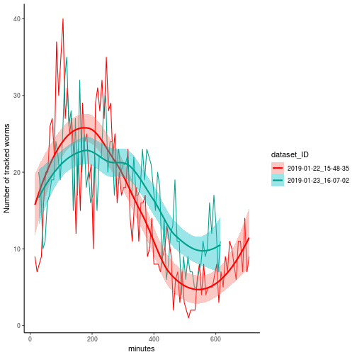

## R Markdown

This is an R Markdown document. Markdown is a simple formatting syntax for authoring HTML, PDF, and MS Word documents. For more details on using R Markdown see <http://rmarkdown.rstudio.com>.

When you click the **Knit** button a document will be generated that includes both content as well as the output of any embedded R code chunks within the document. You can embed an R code chunk like this:


```r
dfp %>%
  select(minutes, dataset_ID, TrackID) %>%
  group_by(minutes, dataset_ID) %>%
  summarise(.,n = n_distinct(TrackID)) %>%
  ggplot(.,aes(x=minutes,y=n,fill=dataset_ID,colour=dataset_ID))+
  scale_colour_manual(values = wes_palette("Darjeeling1"))+
  geom_line()+
  geom_smooth(method="loess")+
  ylab("Number of tracked worms")+
  theme_classic()
```

```
## Adding missing grouping variables: `tp`, `file_name`
```



## Including Plots

You can also embed plots, for example:


Note that the `echo = FALSE` parameter was added to the code chunk to prevent printing of the R code that generated the plot.
